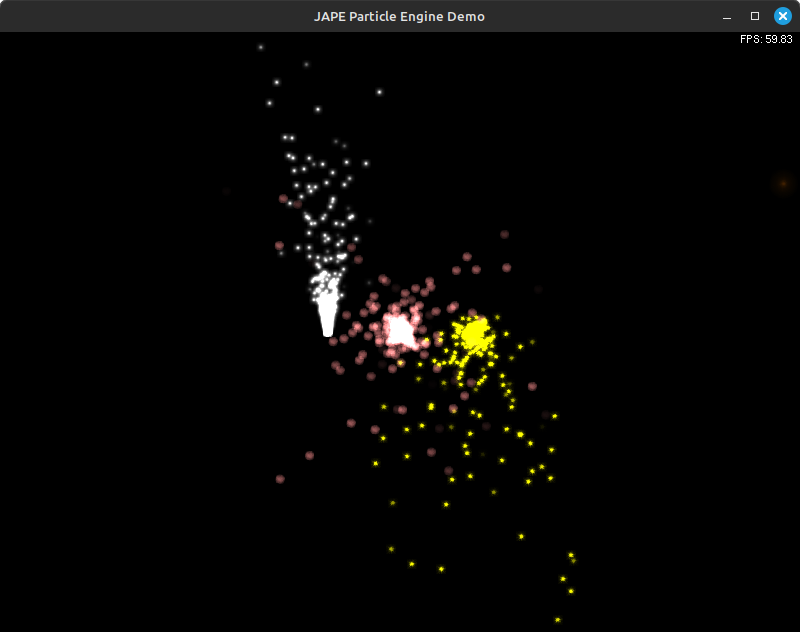

# JAPE: James' Amazing Particle Engine

Written a very long time ago when I barely new what C was. It's not very amazing :)



## Running

`glpng` installs to a non-standard path, so the example must be run something like

```bash
LD_LIBRARY_PATH="/usr/local/lib" ./openglMain
```

You can find the actual path with ` fd glpng /usr`.
